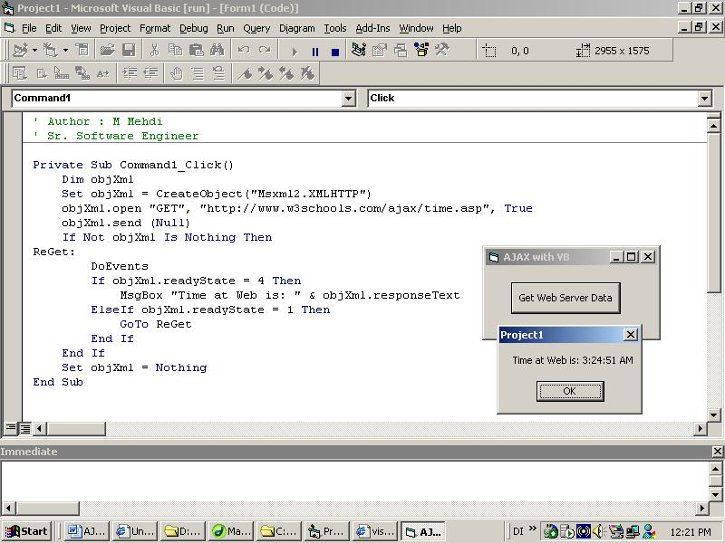

<div align="center">

## AJAX with VB


</div>

### Description

Working of AJAX with VB. When you want to get data directly from server. Very useful in ASP Applications, when you need to create dynamic and interactive pages without refreshing page and without making a roundtrip to server. This was made popular in 2005 by Google Suggest.

Google Suggest is using the XMLHttpRequest of Java Script object to create a very dynamic web interface: When you start typing in Google's search box, a JavaScript sends the letters off to a server and the server returns a list of suggestions.
 
### More Info
 


<span>             |<span>
---                |---
**Submitted On**   |
**By**             |[M\.Mehdi](https://github.com/Planet-Source-Code/PSCIndex/blob/master/ByAuthor/m-mehdi.md)
**Level**          |Beginner
**User Rating**    |3.7 (11 globes from 3 users)
**Compatibility**  |VB 5\.0, VB 6\.0, ASP \(Active Server Pages\) 
**Category**       |[Coding Standards](https://github.com/Planet-Source-Code/PSCIndex/blob/master/ByCategory/coding-standards__1-43.md)
**World**          |[Visual Basic](https://github.com/Planet-Source-Code/PSCIndex/blob/master/ByWorld/visual-basic.md)
**Archive File**   |[](https://github.com/Planet-Source-Code/m-mehdi-ajax-with-vb__1-68425/archive/master.zip)


### Source Code

```
Private Sub Command1_Click()
  Dim objXml
  Set objXml = CreateObject("Msxml2.XMLHTTP")
  objXml.open "GET", "http://www.w3schools.com/ajax/time.asp", True
  objXml.send (Null)
  If Not objXml Is Nothing Then
ReGet:
    DoEvents
    If objXml.readyState = 4 Then
      MsgBox "Time at Web is: " & objXml.responseText
    ElseIf objXml.readyState = 1 Then
      GoTo ReGet
    End If
  End If
  Set objXml = Nothing
End Sub
```

